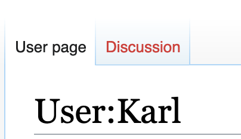

# Mediawiki Installation

This document will take you through most of the installation steps for Mediawiki as well as highlight some of the context-specific configurations and extra hacks that makes mediawiki work for our wiki-to-print workflow.

**Important note**: This sub-directory is mainly empty save for some reference files. This is because it is recommended to install and configure mediawiki directly on your server, rather than including it in your development/versioning workflow. For instance, our `.gitignore` file looks like this:
```sh
wiki/mediawiki
```
A folder dedicated to mediawiki installation files will be created directly on the server and excluded from our git workflow.

There are [several ways of installing mediawiki](https://www.mediawiki.org/wiki/Manual:Installation_guide#Main-installation-guide), and this is the way that worked for our environment. We followed [these steps](https://www.mediawiki.org/wiki/Manual:Installing_MediaWiki) and will highlight them here.

## Requirements
*(software and OS versions are as we had them at the time of installation)*
| Software     | Version |
|--------------|:-------:|
| Debian Linux |   6.3.0 |
| Mediawiki    |  1.37.1 |
| ImageMagick  |  6.9.10 |
| PHP          |  7.3.31 |
| MariaDB      | 10.3.31 |
| Nginx        |  1.14.2 |

Make sure you have already cloned this repository into a web-accessible folder on your remote server.

## Download

Navigate to this folder in your working directory:
```sh
cd /var/www/wiki2print/wiki
```
Download the [latest stable version of mediawiki](https://www.mediawiki.org/wiki/Download):
```sh
wget https://releases.wikimedia.org/mediawiki/1.37/mediawiki-1.37.1.tar.gz
```
Extract the  mediawiki files.
```sh
tar -xf mediawiki-*.tar.gz 
```
Change the name of the extracted folder to `mediawiki` and (optionally) delete the downloaded tarball:
```sh
mv mediawiki-1.37.1 mediawiki
rm mediawiki-*.tar.gz 
```
Your directory should look like this
```sh
ls /var/www/wiki2print/wiki
LocalSettings.example.php
README.md
mediawiki
```
Please note the nested structure here: `mediawiki` is inside our own `wiki` but is excluded from our git workflow (using our top level `.gitignore` file).

## Creating a database

[From the mediawiki installation manual](https://www.mediawiki.org/wiki/Manual:Installing_MediaWiki#Create_a_database): "If you already have a database server and know the root password for it, the MediaWiki installation script can create a new database for you... If you don't know the root password, for example if you are on a hosted server, you will have to create a new database now."

We already have a MariaDB database server installed; however, the web-installer won't have access to our database's root user, so we manually create a database and enter the information into the web-installer later. Note that this isn't the only mediawiki installed on our server, so we took care to name the databases differently.

First login to mysql as root:
```sh
mysql -u root -p
# enter root user password
```
Then, create a database for the wiki, a dedicated user, and grant permissions (change 'password' to something else):
```sql
CREATE DATABASE wiki2printDB;
CREATE USER 'wiki2printUSER'@'localhost' IDENTIFIED BY 'password'; 
GRANT ALL PRIVILEGES ON wiki2printDB.* TO 'wiki2printUSER'@'localhost' WITH GRANT OPTION;
quit
```

## Web Installation

Before heading over to the Web Installation script, make sure you can access the files you just put on the server through a web-browser. We have attached an [NGINX example configuration](/wiki2print.nginx.example) in the root of this workinng directory. Please refer to [this section](/README.md#nginx) for details on this configuration.

You should be able to access the web-installer on a browser from:
```
YOUR-WIKI2PDF-DDMAIN/wiki/mw-config/index.php
```

We will not go through every step of the installation since most of it is self-explanatory and [well-documented](https://www.mediawiki.org/wiki/Manual:Config_script). We highlight the parts relevant to this project.

### Database Settings

For the database settings we used the following (based on the database we just created):
```
Database type     : MariaDB, MySQL, or compatible
Database host     : localhost
Database name     : wiki2printDB
Database prefix   : 
Database username : wiki2printUSER
Database password : <YOUR-MYSQL-DATABASE-wiki2printUSER-PASSWORD>
```

### Wiki Name and Admin Account

Proceed with naming your wiki and creating your first administrator-user. On this page, make sure to choose 'Ask me more questions' at the bottom.

### User Rights Profile, License, Email and Skins

We chose for the 'Authorized editors only' user rights profile, but this is based on personal preference. Note: choosing 'Private wiki' will make it more difficult to connect this wiki to other interfaces of the project.

We chose for the 'Creative Commons Attribution-NonCommercial-ShareAlike' license. This is based on personal preference and can be changed later and per publication.

Email and Skin settings: We leave these with their default values for now as we return to them later for more rigorous configuration.

We enabled the following extensions and options for the rest of the settings:
```
+ CiteThisPage
+ Interwiki
+ Nuke
+ Renameuser
+ ReplaceText
+ CodeEditor            (important)
+ VisualEditor          (important)
+ WikiEditor            (important)
+ CategoryTree
+ Cite                  (important if your publications use citations)
+ SyntaxHighlight_GeSHi (important)
+ TemplateData
+ PdfHandler             
+ PageImages            (important if you want images)
+ Enable file uploads   (important if you want images)
```

Click 'continue' and wait for the installation to finish. After this you will be prompted to download the LocalSettings.php file. Do so and then re-upload it to the following directory on your server:
```
/var/www/wiki2print/wiki/mediawiki/
```

You will then be able to access your wiki from:
```
YOUR-WIKI2PDF-DDMAIN/wiki/index.php?title=Main_Page
```

In the following sections we work with the LocalSettings.php file rigorously and have attached [our own cofiguration as an example](LocalSettings.example.php).

## Email and User creation (optional)

It is reccomended to set-up an out-bound email address for your wiki, especially if you plan on using settings and extensions that require user authentication or email confirmation.

During our web-installation we opted for a 'Authorized editors only' user rights profile. This means that the wiki can be viewed publicly, but only authorized users can edit it. So from here, we can choose to manually create users, but since several people will be involved in co-producing and editing publications on our wiki, and multiple accounts would be created at different moments in time we decided to go for a gated public sign-up system whereby anyone can request an account, and a group of users, "Bureaucrats", have the permission to confirm or reject these requests.

Before moving forward, we need to set up an email address that is dedicated to this wiki (or a pre-existing one is fine), and configure it to send emails from our wiki. 

Navigate to your LocalSettings.php file (that you placed at the root of your mediawiki installation):
```
cd /var/www/wiki2print/wiki/mediawiki
nano LocalSettings.php
```
and configure your email address with the necessary options and `SMTP` server information (that you can get from you email provider):
```php
$wgEnableEmail      = true;
$wgEnableUserEmail  = true;

$wgEmergencyContact = "karl@hackersanddesigners.nl"; ## use your own email address
$wgPasswordSender   = "karl@hackersanddesigners.nl"; ## use your own email address
$wgNoReplyAddress   = "karl@hackersanddesigners.nl"; ## use your own email address

$wgSMTP = [
  'host'     => 'ssl://smtp.migadu.com',       ## hostname of the email server
  'IDHost'   => 'smtp.migadu.com',             ## these options could all
  'port'     => 465,                           ## be different for you
  'auth'     => true,                          ## especially these ones: 
  'username' => 'karl@hackersanddesigners.nl', ## use your own email account
  'password' => '***************************'  ## must be the actual password :)
];

$wgEnotifUserTalk      = true; 
$wgEnotifWatchlist     = true; 
$wgEmailAuthentication = true;
$wgEmailConfirmToEdit  = true;
```
To test that the sender email has been successfully set-up, go to the wiki interface, login with the admin account you just created, navigate to your preferences, and click "Confirm your email address". If you receive a confirmation email for your account, your sender email was successfully set-up. If you face errors, mediawiki has some [extensive documentation on this](https://www.mediawiki.org/wiki/Manual:$wgSMTP).

If up to here everything went well, we continue with creating our gated public sign-up system with installing the wiki extension [ConfirmAccount](https://www.mediawiki.org/wiki/Extension:ConfirmAccount). From the extension's documentation:

Download the extension and extract the files in a directory called `ConfirmAccount` in your `extensions` folder.
```sh
cd /var/www/wiki2print/wiki/mediawiki/extensions
wget https://extdist.wmflabs.org/dist/extensions/ConfirmAccount-REL1_37-13f8827.tar.gz
tar -xzf ConfirmAccount-REL1_37-13f8827.tar.gz -C .
rm ConfirmAccount-REL1_37-13f8827.tar.gz  # optionally delete the tarball
```
Then, navigate back to your LocalSettings.php file and edit it to set the account creation settings to the following, if they are not like this already:
```php
$wgGroupPermissions['*']['createaccount'] = false; 
$wgGroupPermissions['*']['edit'] = false;
```
then, at the end of the file, load and configure the extension:
```php
# End of automatically generated settings.
# Add more configuration options below.

# ConfirmAccount: requiring the approval of new accounts by a bureaucrat
wfLoadExtension( 'ConfirmAccount' );

$wgMakeUserPageFromBio            = false;
$wgConfirmAccountRequestFormItems = [
	'UserName'        => [ 'enabled' => true ],
	'Biography'       => [ 'enabled' => false, 'minWords' => 50 ],
 	'AreasOfInterest' => [ 'enabled' => false ],
 	'CV'              => [ 'enabled' => false ],
 	'Notes'           => [ 'enabled' => true ],
 	'Links'           => [ 'enabled' => false ],
	'TermsOfService'  => [ 'enabled' => true ],
];
$wgGroupPermissions['bureaucrat']['confirmaccount-notify'] = true; 
```
Finally, run mediawiki's update script which will automatically create the necessary database tables that this extension needs:
```sh
cd /var/www/wiki2print/wiki/mediawiki/maintenance
php update.php
```
To test that this script works, logout of your admin user and you will see a link to 'Request account'. Navigate to the link and attempt to create a test account. You should recieve an email at the test account's email address confirming that you have a pending request for an account. 

Log back in as your admin user and navigate to this link to **manage account requests**:
```
YOUR-WIKI2PDF-DDMAIN/wiki/index.php?title=Special:ConfirmAccounts
```
You will see 1 pending request from your test user. You can accept, hold, reject or mark this request as spam. 
**Note**: By default, only users in the 'Bureaucrats' user group (such as yourself), will be able to access this special page to manage account requests. This can be configured for more groups in the extension's settings but it will suffice for us.

Let's look at how to manage users and user rights. You can navigate to this link to **list users and groups**:
```
YOUR-WIKI2PDF-DDMAIN/wiki/index.php?title=Special:ListUsers
```
And as a bureaucrat, you can navigate to this link to **manage user rights**:
```
YOUR-WIKI2PDF-DDMAIN/wiki/index.php?title=Special:UserRights
```
Here, you can move users in and out of user rights groups. It would be good at this point to have your collaborators create accounts and put a select few of them in the 'bureaucrats' group. From here on they can also manage account requests and user rights.

While we are here, let's handle deleting unwanted users (like our test user(s)). We will install the extension [UserMerge](https://www.mediawiki.org/wiki/Extension:UserMerge). Download and extract the extenstion into the extension folder:
```sh
cd /var/www/wiki2print/wiki/mediawiki/extensions
wget https://extdist.wmflabs.org/dist/extensions/UserMerge-REL1_37-614e434.tar.gz
tar -xzf UserMerge-REL1_37-614e434.tar.gz -C .
rm UserMerge-REL1_37-614e434.tar.gz # optionally delete the tarball
```
And load and configure it into your LocalSettings.php
```php
# UserMerge: merging ('deleting') users

wfLoadExtension( 'UserMerge' );
$wgGroupPermissions['bureaucrat']['usermerge'] = true;
```
Your user and other bureacrats can now vist the following link and **remove/merge users**:
```
YOUR-WIKI2PDF-DDMAIN/wiki/index.php?title=Special:UserMerge
```

## Namespaces

[Namespaces](https://www.mediawiki.org/wiki/Help:Namespaces) are mediawiki's way of thematically organizing pages into functional groups. There are default namespaces such as User (2), User Talk (3), File (6), File Talk (7), Help (12) and Help Talk (13).

Namespaces are given a string as a name (eg. User) and an integer as an index (eg. 2). Namespaces also often come with an *associated Talk namespace*. For the Subject namespace User, the associated Talk namespace is User Talk. Generally, the -Talk counterpart of a Subject namespace is dedicated to discussions around the subject of the page.

The main difference between the two types of associated namespaces is that the Talk namespaces provide the ability to create [Subpages](https://www.mediawiki.org/wiki/Help:Subpages) by default (for topics in a discussion for example), which is not the default behaviour of Subject namespaces. 

Where this becomes interesting for us is that when visiting a page, for instance a user's profile page, mediawiki will always present a tab in the interface, alongside the Subject page, that links directly to the associated Talk page.



In the above example (as with most wikis), the page header presents two tabs, one for the *Subject page* and another for the associated *Talk page*. These tabs link to the following URLs:
```
User page   -> LINK-TO-WIKI2PRINT/wiki/index.php?title=User:Karl
Discussion  -> LINK-TO-WIKI2PRINT/wiki/index.php?title=User_Talk:Karl
```
Notice the pattern in the numeric encoding of the namespace indeces. The Subject namespaces all have even integers and their associated Talk namespaces all have odd integers, with the latter index adding 1 to the former's index. I don't know why.

For our own wiki, we will create a [custom namespace](https://www.mediawiki.org/wiki/Manual:Using_custom_namespaces) to house all our publications' contents and an associated namespaces to house all our publications' styles: 

- Our subject namespace will be **Publishing** and our talk namespace will be **PublishingCSS**.  
- Every publication contents are represented by a single page in the Publishing namespace.
- Every publication's CSS styles is represented by a single page in the PublishingCSS namespace. 
  - Here, we appropriate the Talk namespace for CSS styles that are co-written in the wiki and used in the HTML and PDF renders of our publications.
- A single page is small for a whole publication, so alongside medawiki's [transclusion](https://www.mediawiki.org/wiki/Transclusion) possibilities, we configure both namespaces to allow for [Subpages](https://www.mediawiki.org/wiki/Help:Subpages).
  - This allows for the co-writing, nesting, and weaving of contents, CSS classes and style declarations in a very 'native' way.

In LocalSettings.php we add the following lines:
```php
# Custom publishing namespaces

define("NS_Publishing", 3000); 
define("NS_PublishingCSS", 3001); 
$wgExtraNamespaces[NS_Publishing] = "Publishing";
$wgExtraNamespaces[NS_PublishingCSS] = "PublishingCSS";
$wgNamespacesWithSubpages[NS_Publishing] = true;
$wgNamespacesWithSubpages[NS_PublishingCSS] = true;

# We change the content model of the CSS namespace from the default WIKITEXT.
# The forces the CodeEditor to replace the VisualEditor for better legibility.
$wgNamespaceContentModels[NS_PublishingCSS] = CONTENT_MODEL_CSS;

# We need to force the VisualEditor to exist in our Publishing namespace.
$wgVisualEditorAvailableNamespaces = [
  'Publishing' => true
];
```

From here on a publication can be created or accessed with the following URLs.
```
Content Page -> LINK-TO-WIKI2PRINT/wiki/index.php?title=Publishing:PUBLICATION_NAME
Styles Page  -> LINK-TO-WIKI2PRINT/wiki/index.php?title=PublishingCSS:PUBLICATION_NAME
```

## User Interface Sugar 

At this point the wiki part of the wiki2print workflow is ready, so the rest of these configurations are optional.

### Skins 

We went for the mediawiki [Citizen](https://www.mediawiki.org/wiki/Skin:Citizen) skin:
```sh
cd /var/www/wiki2print/wiki/mediawiki/skinss
wget https://github.com/StarCitizenTools/mediawiki-skins-Citizen/archive/main.zip
unzip main.zip
mv mediawiki-skins-Citizen-main Citizen
```
And LocalSettings.php
```php
# Custom skin

wfLoadSkin( 'Citizen' );
$wgDefaultSkin = "citizen";
```

### Extra Buttons

Although the Citizen skin is really pretty it hides the 'Discussion' tab in a context menu, and it becomes a bit more difficult to switch between the subject and talk namespaces of a page. So we will write to custom JS and CSS to bring back the button.

Mediawiki provides the ability to [inject custom JS and CSS](https://www.mediawiki.org/wiki/Manual:Interface/JavaScript) into the webpage that can be written by any bureucrat user. The links to these files are as follows:
```
Common.js  -> YOUR-WIKI2PDF-DDMAIN/wiki/index.php?title=Mediawiki:Common.js
Common.css -> YOUR-WIKI2PDF-DDMAIN/wiki/index.php?title=Mediawiki:Common.css
```
The scripts create and style buttons that give editors access to the different namespaces of a page at appropriate places. We have attached our own Common.js and Common.css files here for reference:
- [Common.js](Common.js)
- [Common.css](Common.css)  

To test that they are working visit/create a page in the Publishing namespace; you should see a pink button in the header bar that takes you to the associated page in the PublishingCSS namespace.

### Main Page

And lastly, for the sake of the sanity of your publication makers and co-conspirators, it's reccomended to write some documentation on how the wiki works. We've decided to put this in the Main Page of our wiki.

To do this, you can create a new page titled "Welcome" or whatever, and point your main page to it by editing the text on this page to read "Welcome":
```
YOUR-WIKI2PDF-DDMAIN/wiki/index.php?title=MediaWiki:Mainpage
```
